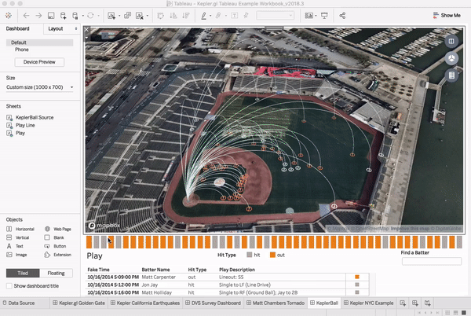
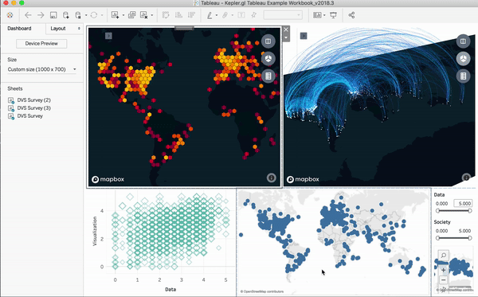

# Kepler.gl Tableau

## Introduction



This is the kepler.gl tableau extension. It will load a kepler.gl map visualization inside your Tableau Desktop App. You can use the same UI as in the kepler.lg demo app to interact with your map. The map can also be set up to communicate with your other Tableau charts.

Due to the required WebGL support. This extension is supported on **Tableau Desktop (Mac Only) 2018.3** or **>= 2019.1.2** and **Tableau Server**.

## Env Requirements
Tableau Desktop (Mac Only) 2018.3 or >= 2019.1.2 and Tableau Server

## Quick Start
#### Step 1: Locate kepler.gl on the extension Gallery

#### Step 2: Click ‘Allow’ to permit the extension to run.


#### Step 3: Custom configurations
Select sheet to plot, setup your own mapbox access token (optional) and how to do you want Tableau dashboard to communicate with your kepler.gl map. **kepler.gl is a client-side app. Your data stays in your Tableau application.**


#### Step 4: Interact with your map in kepler.gl.



#### Step 5: Save and reload
No action is needed to save your map. kepler.gl will automatically save it to your Tableau session.

#### Step 6: Submit Feedback and Help us Test!

## Local Development Setup
For a development installation (requires npm, node and yarn):

Install [node](https://nodejs.org/en/download/package-manager/) (`> 8.15.0`), [yarn](https://yarnpkg.com/en/docs/install). For best management of Node versions, use [nvm](https://github.com/creationix/nvm)
then simply run `nvm use 8`.

This project was bootstrapped with [Create React App](https://github.com/facebookincubator/create-react-app).

### Start local app
##### 1. Clone repo
```sh
git clone git@github.com:uber/kepler.gl-tableau.git
```

##### 2. Install
```sh
yarn --ignore-engines
```

##### 3. Start local app session
```sh
yarn start
# or
npm start
```

### Setup local extension in Tableau Desktop
##### 1. Launch Tableau
open tableau workbook (get it from public folder of this repo)
- NOTE: if you want to enable remote debugging, use this command in terminal to open tableau

```sh
open /Applications/Tableau\ Desktop\ 2019\.1.app --args --remote-debugging-port=8696
```

A debug session will be available in browser http://localhost:8696

##### 2. Execute extension in tableau

- copy the `datablick-kepler-gl.trex` file (inside the `public` folder) into your `extensions` folder of the `My Tableau Repository` (likely in your `Documents` folder).

- Go to the Tableau window that opened when running the above command.

- Drag the extension onto view and select the trex file from your my tableau repository\extensions folder.

- More information on [Tableau Extensions API](https://tableau.github.io/extensions-api/#) about [Get Started with Dashboard Extensions
](https://tableau.github.io/extensions-api/docs/trex_getstarted.html)

### Deploy
Deploy local app to uber.github.io, this will be the app that Tableau extension loads from
```sh
npm run deploy
```

## Links
- [kepler.gl Support Policy](https://kepler.gl/policy)
- [Privacy Policy](https://lfprojects.org/policies/privacy-policy/)
- [Term of Use](https://lfprojects.org/policies/terms-of-use/)
