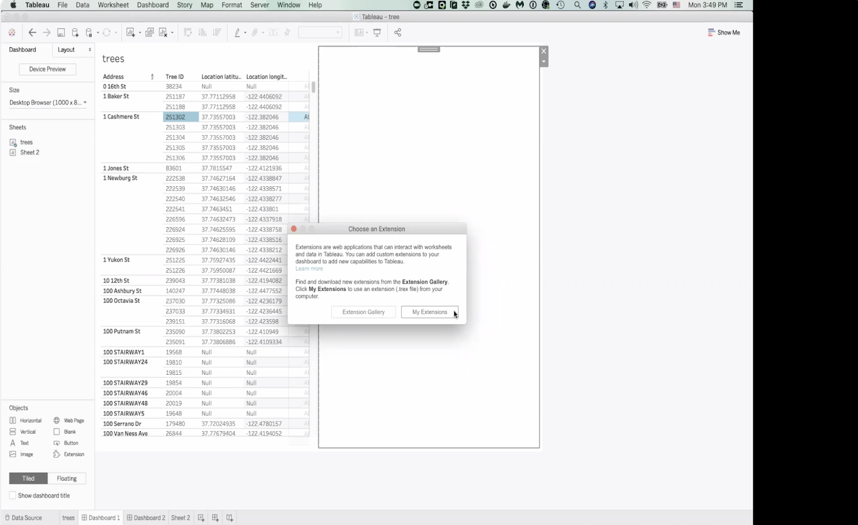
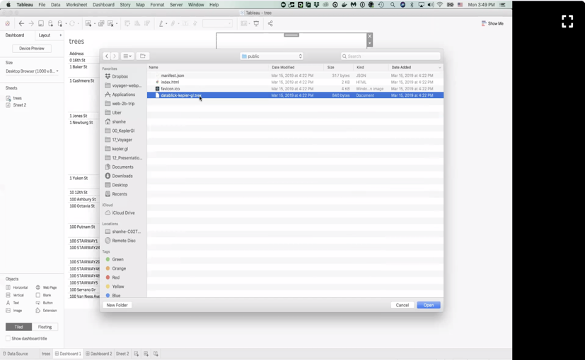
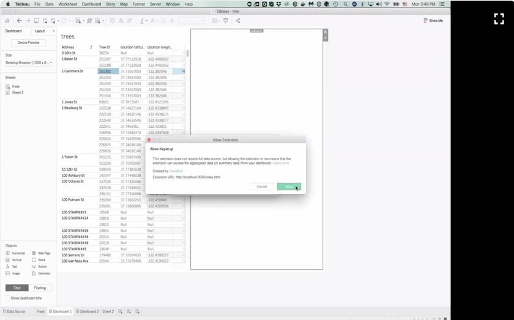
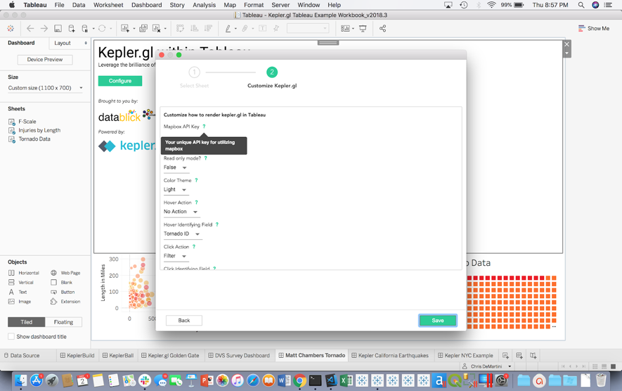

# Kepler.gl for Tableau User Guide

## Instructions

#### Env Requirements
Tableau Desktop (Mac Only) 2018.3 or >= 2019.1.2 and Tableau Server

*Tableau extensions are only supported in Tableau Desktop and Tableau Server, not supported in Tableau Public. WebGL is only supported in Tableau on Mac, version 2018.3 or >= 2019.1.2.*

###### Step 1: Download Kepler Tableau Extension from [Dropbox](https://www.dropbox.com/s/ubvopxvjo2dencv/datablick-kepler-gl.trex.zip?dl=0) or [Github](https://github.com/uber/kepler.gl-tableau/tree/master/public)

Note: You will likely want to save your extension file into your My Tableau Repository/Extensions folder.

###### Step 2: Extensions will only work on a Tableau “Dashboard”. Once you have created a dashboard and loaded at least 1 sheet with data onto it you can then drag the ‘Extension’ button from the bottom left of the toolbar to any spot on the Dashboard pane. You will then see this prompt and can click the ‘My Extensions’ button.

###### Step 3: Locate the Downloaded Tableau extension file (.trex) (if you followed our suggestion above it will be in My Tableau Repository/Extensions)

###### Step 4: You will then be prompted for permitting the extension to run. Click ‘Allow’

###### Step 5: Custom configurations

The configuration capabilities of the extension will change over time, however, you will be able to set multiple configurations on your way into [kepler.gl](https://kepler.gl/) within Tableau. Each of these options also has a help description in the ? attached to each title. This content should explain what the purpose of the configuration is. If this is unclear to you during your use it would be great for us to know that we need to provide more guidance in this configuration screen. 

###### Step 6: Using [kepler.gl](https://kepler.gl/) within Tableau

At this point you can use [kepler.gl](https://kepler.gl/) as you normally would. If you need additional detail on how to use [kepler.gl](https://kepler.gl/) to begin with, please visit the kepler.gl demo and guidance documentation at https://kepler.gl/. 

###### Step 7: Submit Feedback and Help us Test!

For feedback/ feature requests, please let us know through the [kepler.gl Slack Channel](https://github.com/keplergl/kepler.gl/issues/643). We also encourage you to share your maps here to the rest of the map enthusiasts in the room too.

Useful Links

- [Kepler.gl User Guide](https://github.com/keplergl/kepler.gl/blob/master/docs/user-guides/a-introduction.md)
- [Kepler.gl Slack Channel](https://github.com/keplergl/kepler.gl/issues/643)
- [Presentation by Shan and Chris at SFBATUG](https://vimeo.com/332524556/36fd0b2cbe) start at 58 minutes

Happy Mapping :)
